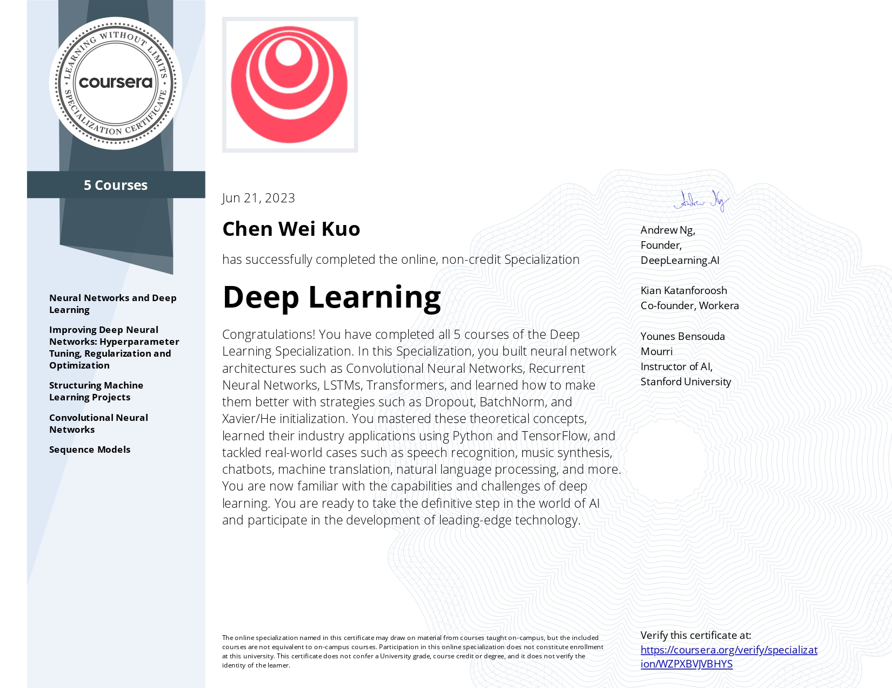
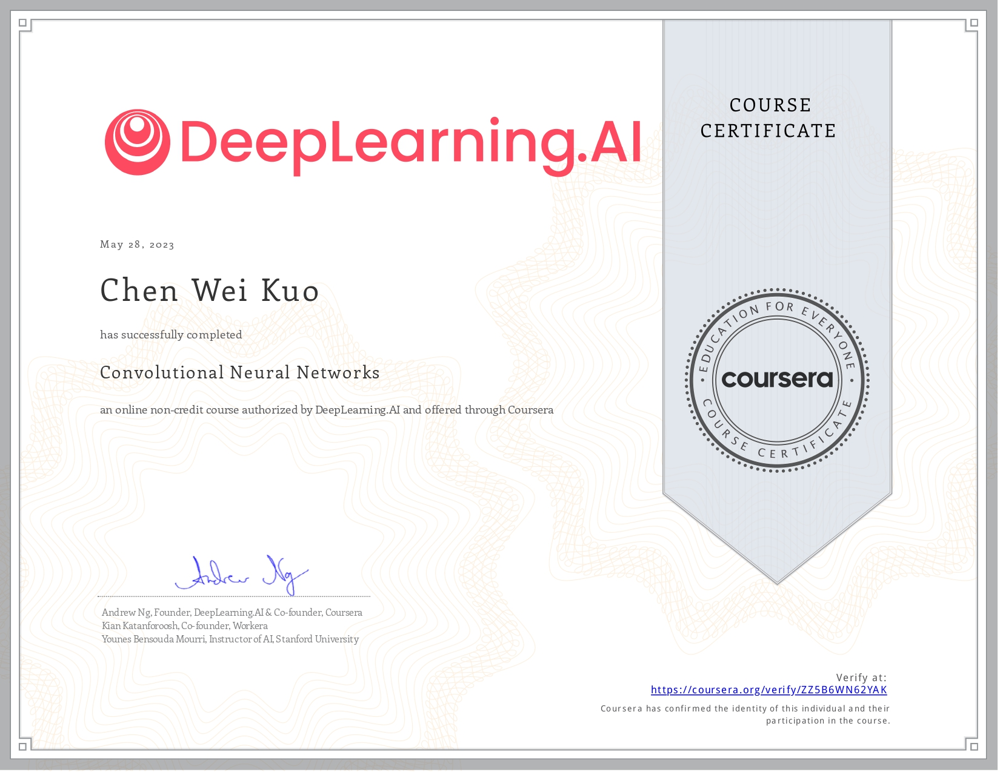

# coursera-deep-learning-specialization
This repository are a selection of the projects I did for the Coursera Deep Learning Specialization.   
Those projects are done in Python and in Tensorflow, and ranges from simple logistic regression to Convolutional Neural Networks and Recurrent Neural Networks.  
Below are the 6 certificates I got for completing the specialization.

## Certificates
### Deep Learning Specialization

### Neural Networks and Deep Learning

### Improving Deep Neural Networks: Hyperparameter tuning, Regularization and Optimization

### Structuring Machine Learning Projects

### Convolutional Neural Networks

### Sequence Models
