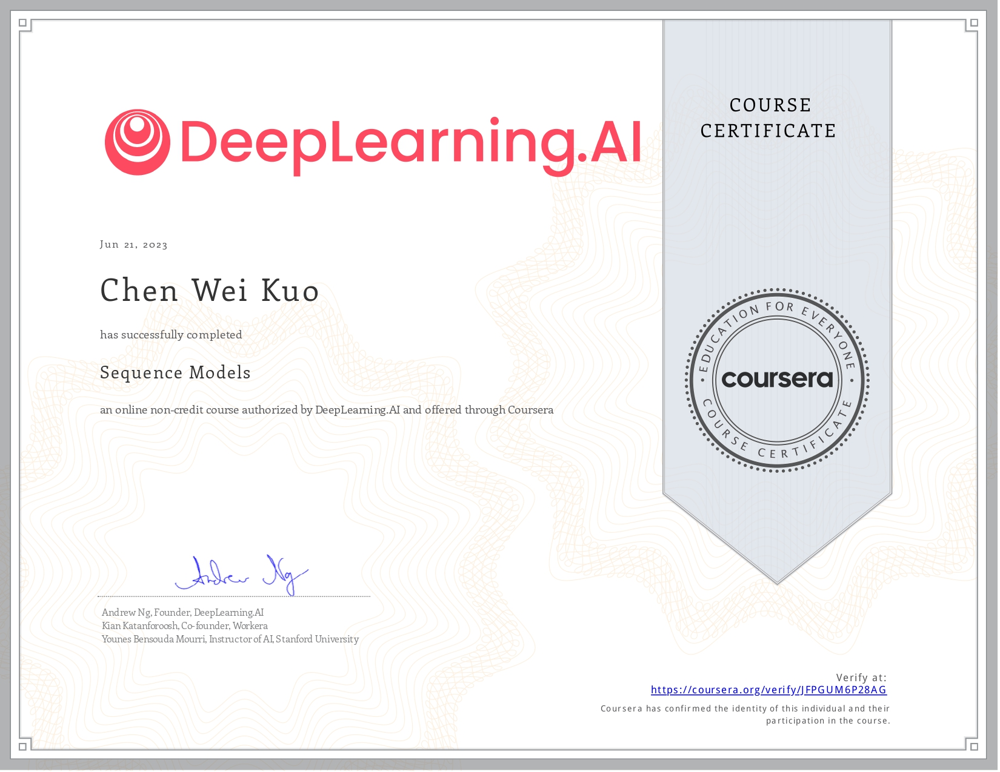

# coursera-deep-learning-specialization
This repository are a selection of the projects I did for the Coursera Deep Learning Specialization.   
Topics covered include:  
1. **Deep Neural Networks Construction:**
   - Build and train deep neural networks, focusing on identifying key architectural parameters.
   - Implement vectorized neural networks and apply deep learning to various applications.

2. **Data Analysis and Model Evaluation:**
   - Manage train-test sets, analyze variance in deep learning applications.
   - Employ standard techniques and optimization algorithms for effective model training using TensorFlow.

3. **Convolutional Neural Networks (CNN):**
   - Develop a CNN for tasks such as detection and recognition.
   - Explore neural style transfer techniques for generating artistic content.
   - Apply algorithms to process image and video data effectively.

4. **Recurrent Neural Networks (RNN) and Natural Language Processing (NLP):**
   - Construct and train RNNs, explore NLP, and delve into Word Embeddings.
   - Utilize HuggingFace tokenizers and transformer models for tasks like Named Entity Recognition (NER) and Question Answering.

Below are the 6 certificates I got for completing the specialization.
## Certificates
### Deep Learning Specialization

### Neural Networks and Deep Learning

### Improving Deep Neural Networks: Hyperparameter tuning, Regularization and Optimization

### Structuring Machine Learning Projects

### Convolutional Neural Networks

### Sequence Models
